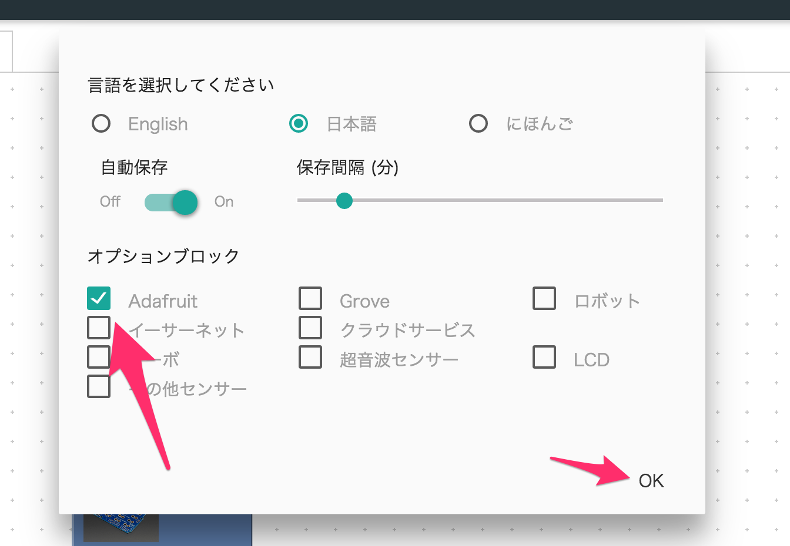

# 目次

- [BlocklyDuinoの基本的な使い方](#1)
- [いろんなもので、音をコントロールしてみよう！](#2)
- [LEDリングをプログラミングしてみよう！](#3)

# <a href="#1">BlocklyDuino の 基本的な使い方</a>

[ここ](http://qiita.com/okhiroyuki/items/f6ed9a78a41612e8ec08)を参考にしてください。

# <a href="#2">いろんなもので、音でコントロールしてみよう！</a>

Arduinoに果物などを繋ぎ、楽器にしようというものです。

## 必要なもの

### ハードウェア
- [Adafruit 静電容量センサシールドキット](https://www.switch-science.com/catalog/2240/)
- [テストクリップ](https://www.switch-science.com/catalog/2132/)
- 果物やアルミホイルなど

### ソフトウェア

- [Arduino IDE](https://www.arduino.cc/en/Main/Software)
- [BlocklyDuino](https://chrome.google.com/webstore/detail/blocklyduino-editor/ohncgafccgdbigbbikgkfbkiebahihmb?hl=ja)
- [Processing](https://processing.org/download/)

### コード
ArduinoとProcessingそれぞれに、コードを用意しています。

- Arduino : banana
- Processing : banana

## 仕組みの概要

1. Arduinoに繋いだ果物を触ると、静電容量の変化が生じます。
2. その変化を検知し、どこの番号が変化したかをシリアル通信を介して、パソコンに通知します。 
3. パソコン側はProcessingというソフトで、データが来るのを待機しており、データがくるとその番号にあった音楽ファイルを再生します。

## 注意する点

### クリップとセンサーシールドのつなぐ場所

センサーシールドの0〜3に、クリップを繋いでください。

### ArduinoでのLibraryの追加
Arduino IDEに、banana.inoを読み込み、Arduinoへ書き込みをしようとしても、[Adafruit_MPR121_Library](https://learn.adafruit.com/adafruit-mpr121-12-key-capacitive-touch-sensor-breakout-tutorial/wiring)が入っていないとエラーを吐きます。

このため、下記の手順で必要なライブラリをインストールしてください。

1. [Adafruit_MPR121_Library](https://learn.adafruit.com/adafruit-mpr121-12-key-capacitive-touch-sensor-breakout-tutorial/wiring)をダウンロードしてください。この際、Adafruit_MPR121-master.zipを解凍しないでください。
2. Arduino IDEを開き、スケッチ > ライブラリのインクルード > .ZIP形式のライブラリをインストールより、Zipファイルを読み込む。 


### ポートの指定
Aruinoにコードを書き込む際に、まだエラーがでる場合は、ポート指定がうまくいっていない可能性があるため、Arduinoのポートを指定してくだい。


### Processing

#### ライブラリの追加
Processingでは、ddf/minimライブラリを追加する必要があります。

下記の手順で必要なライブラリをインストールしてください。
1. スケッチ > ライブラリのインポート > ライブラリを追加 で、Contribute Manager を開く

   

2. minimライブラリを検索し、インストール

   

#### プログラムを起動
Processingのプログラムは、三角ボタンを押すと、起動できる。


#### 動かない場合
Processingのプログラムが動かない場合、シリアルポートの指定がうまくいっていない可能性がある。
このため、下記の手順でコードの一部を自分の環境に合わせて編集してください。

1. コンソールに書きだされたシリアルポートを確認する。
2. Arduinoのシリアルポートの順番を確認し、コード `String portName = Serial.list()[※]`に反映する。


#### 音楽ファイルの編集
下記のコードを編集すると、その番号の音楽を変更できます。

素材は、dataフォルダにあります。

```
void setup() {
  size(800, 400, P3D);
  soundfile[0] = "drum1_cymbal.mp3";
  soundfile[1] = "drum1_snare.mp3";
  soundfile[2] = "drum1_tom1.mp3";
  soundfile[3] = "drum1_bassdrum1.mp3";
```

# <a href="#3">LEDリングをプログラミングしてみよう！"</a>


## 必要なもの

### ハードウェア
- [Arduino Uno](https://www.switch-science.com/catalog/789/)
- [NeoPixel Ring](https://www.switch-science.com/catalog/1593/)

### ソフトウェア

- [Arduino IDE](https://www.arduino.cc/en/Main/Software)
- [BlocklyDuino](https://chrome.google.com/webstore/detail/blocklyduino-editor/ohncgafccgdbigbbikgkfbkiebahihmb?hl=ja)

### コード

- Neopixel1: ベーシックに12個のLEDの色を指定して、表示しているサンプルです。
- Neopixel2: ループ処理させることで、いろんな色に変化させているサンプルです。

## NeoPixelの特徴

- LED内部にICチップが入っており、Arduinoから色の指定ができる
- 直接に繋ぐことができ、順番に色を指定できる

## 注意する点

### RGBLEDのブロックが表示されない場合
BlocklyDuino Editorに、RGBLEDブロックが表示されていない場合は、下記の手順で表示させることができます。

1. 設定ダイアログを表示させる。

   

2. Adafruitブロックにチェックを入れて、OKを押す。

   

3. 再起動のあと、ブロックが追加されている。

   

### ライブラリの追加
Arduino IDEに、コードを読み込み、Arduinoへ書き込みをしようとしても、`Adafruit_NeoPixel ライブラリ`がないとエラーを吐きます。

このため、下記の手順で必要なライブラリをインストールしてください。

1. スケッチ > ライブラリをインクルード > ライブラリを管理 から、ライブラリマネージャーを起動する。

   

2. `Neopixel`で検索し、`Adafruit NeoPixel`ライブラリをインストールする。 

   
